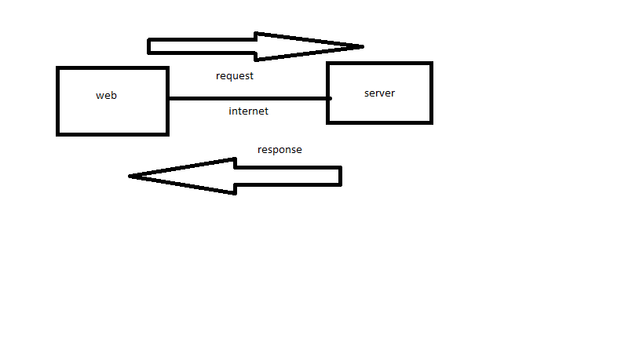

# Project Name - Project Version

**Author Name**: Mohammad Shiyab

## WRRC
Add an image of your WRRC here

## Overview
server built to get  data
## Getting Started
<!-- What are the steps that a user must take in order to build this app on their own machine and get it running? -->
clone this repo
make npm init -y
npm install express cors
create server.js
create json file 
call json data in server js 

## Project Features
<!-- What are the features included in you app -->
get  data in json format
